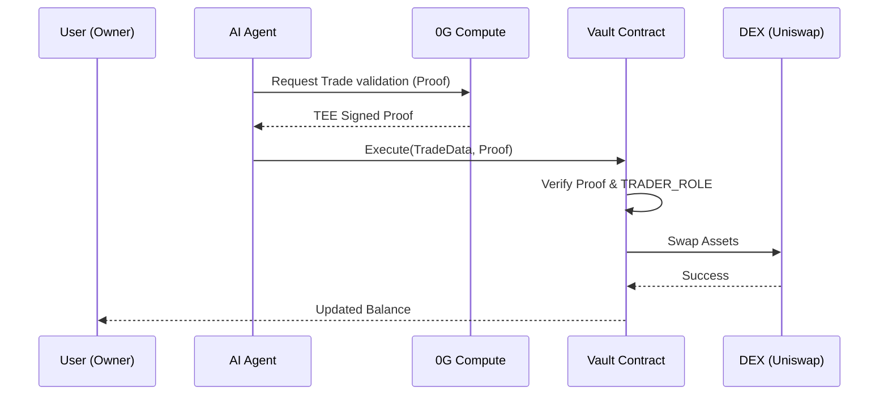

# Security Model: Non-Custodial Trading Vault

Aletheia Finance uses a **Non-Custodial Vault** architecture to ensure that user funds are never at risk from external parties or the AI agent itself.

## 1. Governance Structure
The system is built on a "Least Privilege" model:

| Role | Entity | Capabilities | Constraints |
| :--- | :--- | :--- | :--- |
| **Owner** | User (Wallet) | Deposit, Withdraw, Grant Roles, Revoke Roles | Exclusive power to move funds out of the Vault. |
| **Agent** | AI Agent | Execute Trade, Check Balance | Can only swap assets on whitelisted Dexes (Uniswap). |
| **Contract** | Smart Contract | Logic Enforcement | Verifies proofs from the 0G Network before allowing a swap. |

## 2. The Permission Handshake
To activate a strategy, the following cryptographic handshake occurs:
1. **Connect**: User connects via MetaMask.
2. **Deposit**: User sends funds (e.g., USDT) to their personal Vault address.
3. **Approve**: User sends an on-chain transaction: `vault.grantRole(AGENT_ADDRESS, TRADER_ROLE)`.
4. **Link**: User signs a strategy rulebook and stores it on **0G Storage** (See SOP 1).

## 3. Trade Execution Flow

## 4. Safety Invariants
- **No Withdrawal Rights**: The `TRADER_ROLE` specifically lacks the `WITHDRAW` permission.
- **Whitelisted Callers**: The Vault only allows calls to known, audited DEX routers.
- **Proof-Gated**: No trade can happen without a corresponding proof of strategy adherence stored/verified via **0G**.
